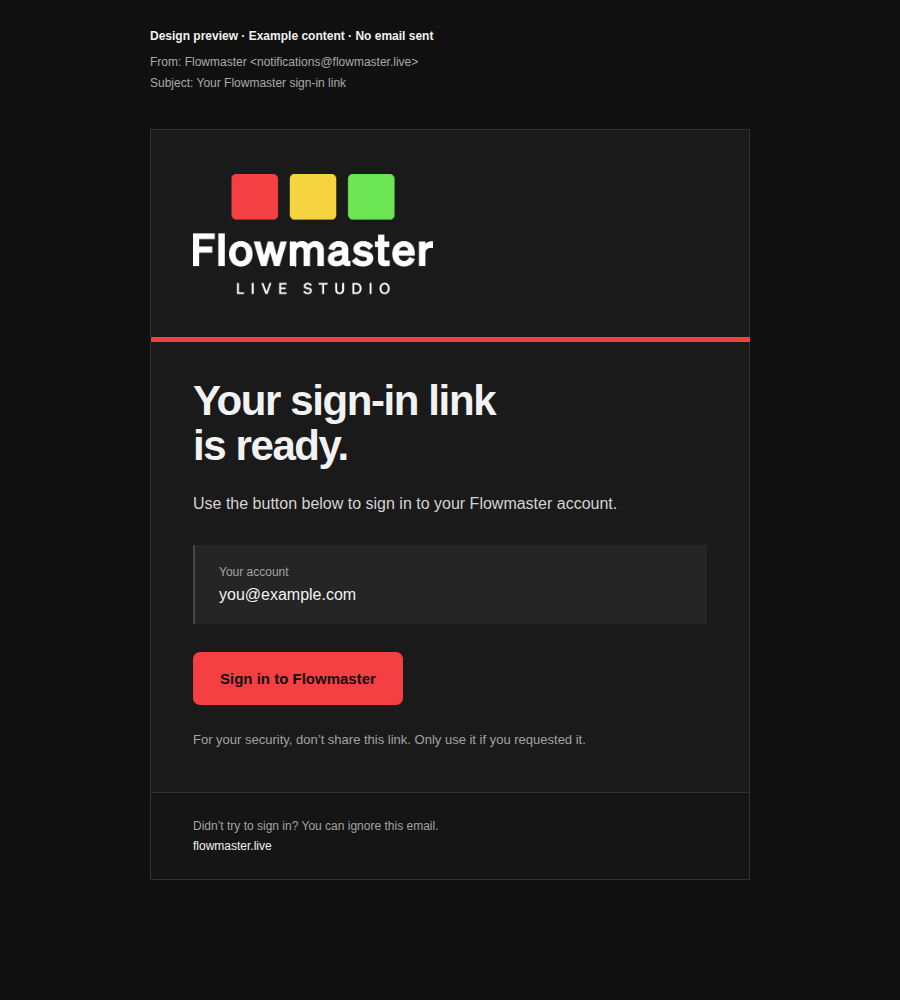

# Flowmaster transactional emails — start here

Updated 2026-10-06. The owner approved the brand treatment and requested durable PNG references plus setup notes for future agents. **Visual approval is separate from implementation and live delivery status.**

[Approved desktop PNG](docs/email/approved-desktop.png) · [Approved mobile PNG](docs/email/approved-mobile.png) · [Asset provenance](docs/email/README.md) · [Preview HTML](outputs/2026-10-06-system-email-mockups/email.html)

## Approved visual treatment

Use the exact settled composition in [AnimatedLogo.astro](src/components/AnimatedLogo.astro), with [global.css](src/styles/global.css) colors. The approved static export preserves the original vector lettering and these desktop dimensions before uniform scaling:

- Three 55×53 squares, separated by 13px; red `#f43f43`, yellow `#f5d440`, green `#6be553`.
- 280px Flowmaster wordmark, 180px LIVE STUDIO descriptor, 16px between the three rows.
- Email displays the complete lockup at 240px wide, with 44px above and 40px below.

Do not substitute the suite's older packaged horizontal-lockup PNG: its internal composition is different. Do not recreate the wordmark with ordinary text or stretch parts independently. Dark surfaces `#101010` / `#1a1a1a` / `#252525`; red action with dark text.

## Setup status and next steps

The intended service identity is `Flowmaster <notifications@flowmaster.live>` through Resend. Live verification on 2026-10-06 confirms the domain is verified and open/click tracking are disabled.

**Native signup confirmation and password-recovery templates are now installed in the current Supabase project `wwuafjftlttmkvhzgtxh`, using Resend SMTP.** The project was paused and has been resumed; Auth health and configuration readback pass. The original sign-in mockup remains a visual reference, not an enabled magic-link feature. Runtime templates and setup scripts are in sibling `flowmastersuite`, branch `codex/flowmaster-account-email-20261006`, Windows-visible at `work/2026-10-06-account-email/checkout/TRANSACTIONAL_EMAILS.md`. The owner-approved live test passed: two emails delivered, signup confirmation and password recovery completed through the real website, old passwords and consumed links rejected. The temporary account was removed; existing owner accounts stayed unchanged.

2026-10-07: owner authorized publishing account-email availability. The live tests passed; evidence is saved as `flowmastersuite/docs/email/owned-inbox-test.json` on the integration branch. `src/data/supabase.json` is now `emailReady: true`; the account page enables signup and password recovery. Published through PR #2 on 2026-10-07; GitHub Pages succeeded and https://flowmaster.live/account passed desktop/mobile enabled-control and request-wiring checks. `ACCOUNT_EMAIL_VERIFIED=true` is set and read back in alenzie/flowmastersuite. Final browser evidence is in `outputs/2026-10-07-account-release/browser-verification.json`. Corrected Gmail dark-mode appearance was approved by the owner on 2026-10-07; spam placement was not separately reported. The runtime PNG is the exact approved asset at `public/images/email/flowmaster-lockup-v1.png`; SMTP uses its publicly accessible immutable GitHub copy pinned to commit `2ddc9e414486ec8e19093dfd6ed3675e7074c3fc`. This rollout enables account emails only. Administrator access, Scout enrollment, purchases, inbox provisioning and installer downloads remain separate.

## Sender roles agreed with the owner

| Brand | Automated service sender | Human correspondence idea (separate setup) |
| --- | --- | --- |
| Alexander Blair | `bookings@alexanderblair.com` for appointments | `hello@alexanderblair.com` |
| Spindle | `notifications@spindle.chat` for account/billing/service mail; `bookings@spindle.chat` for appointments | `contact@spindle.chat` |
| Flowmaster | `notifications@flowmaster.live` | `hey@flowmaster.live` |

Resend is the selected transactional delivery provider. Sending identities do not by themselves establish working inboxes or reply routing. The human addresses above are owner preferences, not evidence that receiving or Reply-To has been provisioned. Do not silently use another brand's sender.

Domain administration recorded by owner: alexanderblair.com → Cloudflare; spindle.chat → GoDaddy; flowmaster.live → Namecheap. These are historical setup notes, not a current DNS verification. Check the relevant Resend domain and actual DNS authority before deployment; do not overwrite mailbox MX records based on this note.

Keep provider credentials server-side in the deployment secret store or a gitignored local environment file. Never copy keys into these notes, browser assets, email HTML or screenshots. A credential configured for one project does not establish configuration in another.

## Gmail dark-mode correction

2026-10-07: owner-reported Gmail iOS inversion made the original transparent white logo unreadable on a light background. The suite’s shared Auth email frame now preserves backgrounds and text using Gmail-targeted CSS; both live templates were updated and read back. 24 browser simulation cases passed; the owner approved the fresh preview in Gmail dark mode on 2026-10-07 (“Looks good”). Original approved PNGs above remain historical design references, not cross-client proof. See `flowmastersuite/docs/email/README.md` on the integration branch for evidence and current status.
